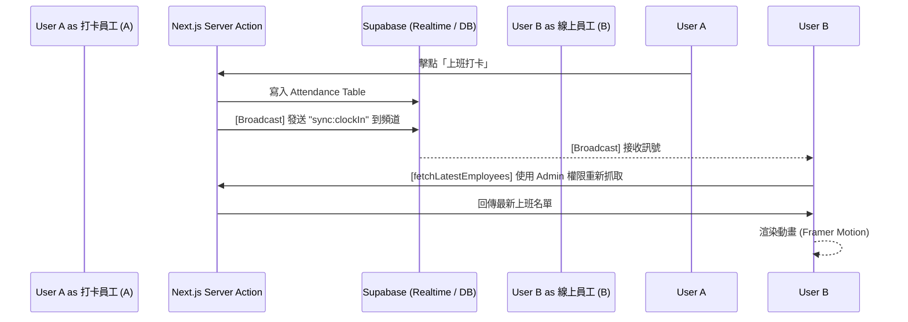

# 即時上班同仁頭像功能規格書 (Realtime Attendance Avatars Spec)

> **版本**: v1.0
> **狀態**: 已實作 (Implemented)
> **目標**: 在打卡頁面即時顯示當前「上班中」的人員名單，透過頭像與流暢動畫提升團隊連動感，並確保極低延遲與高安全性。

---

## 1. 功能概觀 (Feature Overview)

在打卡鐘按鈕下方，系統會動態渲染一列「正在上班中」的員工大頭貼：
- **即時同步**: 透過 Supabase Realtime Broadcast 頻道，當任一同事點擊「上班」、「下班」或「取消下班」時，所有其他掛在網頁上的使用者會在一秒內自動更新名單。
- **視覺呈現**: 頭像水平重疊堆疊 (`-ml-3`)，游標移入時會顯示浮動姓名標籤 (Tooltip)。
- **動態效果**: 使用 Framer Motion 實現 Q 彈的物理進場動畫，以及優雅緩慢的退場（下沉消失）動畫。

---

## 2. 技術架構 (Technical Architecture)

### 2.1 溝通機制：Supabase Channel Broadcast
為了跨越資料庫 **Row Level Security (RLS)** 的權限隔離（普通員工無法 SELECT 其他人的考勤紀錄），本功能**不採用**傳統的 `postgres_changes` 監聽。
- **發送端 (Server Actions)**: 在 `clockIn`, `clockOut`, `cancelClockOut` 功能執行完畢後，伺服器會立即呼叫 `supabase.channel('public:attendance_sync').send(...)`。
- **匿名廣播**: Broadcast 頻道不帶敏感負擔 (Payload Only)，僅發送一個「刷新信號」。
- **接收端 (Client Component)**: `WorkingEmployeesList` 元件持續監聽該頻道，一旦收到信號，即觸發 `fetchLatestEmployees()` 與 `router.refresh()`。

### 2.2 權限處理：RLS Bypass (Admin Client)
- **問題點**: 一般員工受 RLS 限制，呼叫 `SELECT` 只能撈到自己的出席資料。
- **解決方案**: 獲取上班名單的 API `getCurrentWorkingEmployees` 內部使用 `createAdminClient()` (帶有 `SERVICE_ROLE_KEY`)。
- **資安約束**: 該 API 僅有條件地暴露 `users` 表的 `display_name` 與 `avatar_url`，嚴禁傳回任何薪資、私密個資或精確打卡時間。

---

## 3. 元件細節 (Component Details)

### 3.1 `WorkingEmployeesList.tsx` (Client Side)
- **封裝邏輯**: 
    - 使用 `AnimatePresence` 處理元件被移除時的退場動畫。
    - 使用 `motion.div` 包覆每個頭像。
- **動畫配置 (Framer Motion)**:
    - **進場 (Initial/Animate)**: `y: 20` -> `0`, `scale: 0.5` -> `1` (Spring 效果)。
    - **退場 (Exit)**: `y: -40`, `duration: 0.8s`, `ease: "easeInOut"`。
    - **補位 (Layout)**: 設定 `layout` 屬性，當某頭像消失時，其他頭像會平滑滑向新位置而非突閃。

---

## 4. 資料流 (Data Flow Diagram)

---

## 5. 環境變數要求
欲使此功能運作，本機環境 (.env.local) 或部署平台必須設定：
- `SUPABASE_SERVICE_ROLE_KEY`: 用於繞過 RLS 安全隔離來生成跨員工的大頭貼名單。
