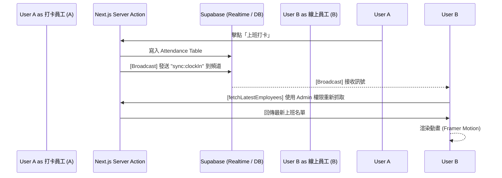

# 即時系統與頭像功能規格書 (Realtime System & Avatars Spec)

> **版本**: v1.1
> **狀態**: 已實作 (Implemented)
> **目標**: 統一管理全站「上班中人員名單」與「系統通知」的即時推送。透過共用的輕量級廣播架構 (Broadcast)，跨越權限阻礙，實現低延遲與高安全性的即時連動。

---

## 1. 功能概觀 (Feature Overview)

### 1.1 即時群體上班頭像 (Realtime Avatars)
- **即時同步**: 透過 Supabase Broadcast，當任一同事點擊「上班」、「下班」或「取消下班」時，所有掛在網頁上的使用者會在一秒內自動更新名單。
- **視覺呈現**: 頭像水平重疊堆疊 (`-ml-3`)，游標移入時會顯示浮動姓名標籤 (Tooltip)。
- **動態效果**: 使用 Framer Motion 實現 Q 彈的物理進場與優雅退場動畫。

### 1.2 即時系統通知 (Realtime Notifications)
- **即時紅點與列表**: 透過相同的 Broadcast 機制，當員工的假單被建立、核准或拒絕時，右上角的鈴鐺圖示會瞬間增加未讀數字，並同步更新下拉選單內容。
- **樂觀 UI (Optimistic UI)**: 收到廣播信號的瞬間即刻將數字 +1，隨後在背景向伺服器拉取最新列表，消除等待體驗。

---

## 2. 技術架構 (Technical Architecture)

### 2.1 溝通機制：共用即時廣播模組 (Shared Realtime Broadcast)
為了跨越資料庫 **Row Level Security (RLS)** 的權限隔離、並減少對資料庫效能的負載，系統 **全面停用** 傳統的 `postgres_changes` 資料表監聽，改採輕量的 WebSocket 廣播。

- **接收端 (Client Hooks)**: 統一使用 `hooks/useRealtimeBroadcast.ts`。無論是接收 `public:attendance_sync` 還是 `public:notification_sync`，皆透過單一底層建立穩定的連線。
- **發送端防護 (Server-side Broadcast)**: Server Actions (如 `clockIn` 或 `applyLeave`) 執行完畢後，透過 `utils/supabase/broadcast.ts` 中的 `sendServerBroadcast()` 工具函式發送。此函式嚴格等待 WebSocket 狀態轉為 `SUBSCRIBED` 後再寄發，徹底解決 Next.js Serverless 環境**無預警關閉連線導致廣播遺失**的致命問題。

### 2.2 跨越安全限制：RLS Bypass (Admin Client)
- **情境A (頭像名單)**: 一般員工受 RLS 限制，呼叫 `SELECT` 撈不到其他同事的資料。解法是 `getCurrentWorkingEmployees` API 在後端使用 `createAdminClient()` (夾帶 `SERVICE_ROLE_KEY`) 撈取，且僅回傳無機密性的姓名與頭像，再回傳給前端。
- **情境B (通知發放)**: 一般員工送出請假申請 (`applyLeave`) 時，系統需要寄通知給管理員。但受制於 RLS，普通員工無權在 `notifications` 表中「替管理員新增資料」。解法為在 `createNotification` 函式內部使用 `createAdminClient()` 執行 `INSERT`，確保系統內部自動發布的通知不被操作者的身份所阻擋。

### 🚨 2.3 核心開發痛點與注意事項：Row Level Security (RLS) 陷阱
本專案在開發「即時上班頭像」與「即時通知」時，均曾長期卡在一個幽靈 Bug：**前後端連線與廣播模組完全正常，但畫面就是收不到資料更新**。其根本原因 100% 來自於 Supabase 的 Row Level Security 權限阻擋：
- **靜默丟棄 (Silent Drop)**：前端發動的 Server Action 如果嘗試跨身份讀寫，Supabase 會基於安全考量直接回傳空陣列或攔截寫入，且**往往不會拋出明顯的 Error**。這導致開發者誤以為是廣播沒發出去。
- **開發鐵則**：未來若要在系統內實作任何需要**跨使用者聯動**的功能（例如 A 員工的動作會觸發寫入 B 主管的通知，或是 A 員工需要看到 B 員工的上線狀態），**在後端 Server Action 中，一律強制使用 `createAdminClient()` 來繞過 RLS 取代一般的 `createClient()`**。

---

## 3. 元件細節 (Component Details)

### 3.1 `WorkingEmployeesList.tsx` (Client Side)
- **封裝邏輯**: 
    - 使用 `AnimatePresence` 處理元件被移除時的退場動畫。
    - 使用 `motion.div` 包覆每個頭像。
- **動畫配置 (Framer Motion)**:
    - **進場 (Initial/Animate)**: `y: 20` -> `0`, `scale: 0.5` -> `1` (Spring 效果)。
    - **退場 (Exit)**: `y: -40`, `duration: 0.8s`, `ease: "easeInOut"`。
    - **補位 (Layout)**: 設定 `layout` 屬性，當某頭像消失時，其他頭像會平滑滑向新位置而非突閃。

### 3.2 `NotificationBell.tsx` (Client Side)
- **樂觀 UI (Optimistic UI)**: 透過元件內部的 state 直接在收到廣播的瞬間 `setUnreadCount(prev => prev + 1)`，製造無延遲的系統回饋感。
- **動畫配置 (Framer Motion)**:
    - 針對鈴鐺上的紅色未讀計數加註了 `<AnimatePresence>` 與 `<motion.span>`。
    - **彈指效果 (Pop-in)**: 透過關鍵影格 (Keyframes) `scale: [0, 1.3, 0.8, 1.1, 1]` 與精確的 `times` 屬性，在 0.4 秒內展現出純粹以大小縮放變化為主、極具彈跳動感 (Q彈) 的提示動畫，全程保持實心不透明以強化視覺捕捉。

---

## 4. 資料流 (Data Flow Diagram)

---

## 5. 環境變數要求
欲使此功能運作，本機環境 (.env.local) 或部署平台必須設定：
- `SUPABASE_SERVICE_ROLE_KEY`: 用於繞過 RLS 安全隔離來生成跨員工的大頭貼名單。
